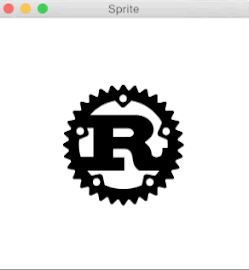

# sprite

A library for sprite hierarchy and scene management

## Example
Here is an [example](https://github.com/PistonDevelopers/piston-examples/tree/master/sprite) what `sprite` can do.

(The gif has low FPS, you can try the example yourself to see the full effect)

